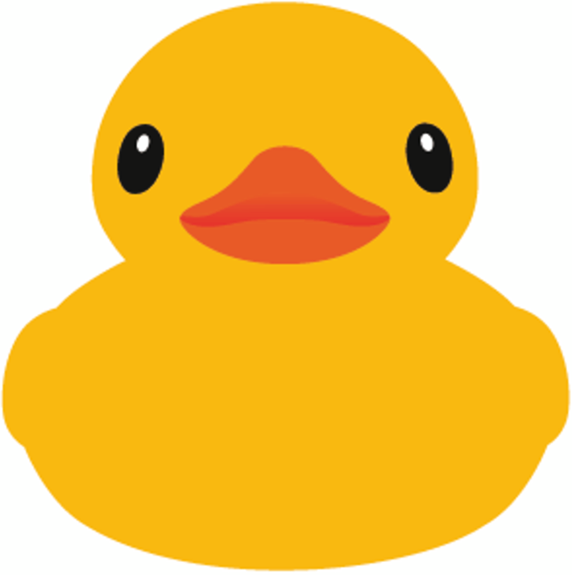

# Hi folks 

I'm a software developer with a PhD 🧑🏻‍⚕️ in Computer Science from Niels Bohr Institute, Denmark. 🇩🇰

I love to tinker with various components and watch them work together in harmony. 👀

Using data to back up my claims is crucial; I want to know why I’m doing what I’m doing. 📈

I am competitive and want to be the best at what I do, which is why I'm always learning. 🤺

 

Previous work places include Elastic and Shopify.

 

## Technologies and Tools 🛠

 

## Other fun stuff 

I enjoy code challenges and puzzles, such as those on [Codewars.com](https://www.codewars.com/).

 

## Find me 💌

